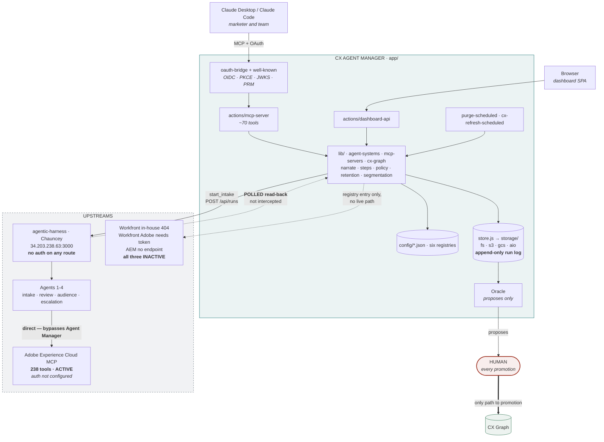

# ARCHITECTURE.md — what actually exists, 16 September 2026

Written from the code in this repo and from the live registries, not from the
design briefs. Where reality differs from the briefs or from the whiteboard
sketch, reality is recorded and the difference is called out in §5.

## 1. The thesis, in David's words

From `Blockers_and_Agent_Intervention_Points-4.pdf`:

> *"Agents already sit on the happy path. The value is at the points where the
> process stalls, loops, or hands off between teams... what is left to attack is
> **waiting time** — the review queue, the nightly job, the DPG response, and
> the two undefined branches at 2.7a and 3.1b."*

**The product is not automation. It is the elimination of waiting.** Every
blocker is a clock, not a task. That single sentence is what justifies Agent
Manager existing separately from the harness: a clock that spans runs cannot be
read from inside one.

## 2. The topology as built



## 3. What each part actually is

**Agent Manager** is `app/`, built on the Company Cookbook engine
(`TAP-CXM/TAP-Cookbook` at `tap-portability-layer/connector/`, commit
`98617f6`, branch `feature/demo-hardening-and-setup-docs`). Node >= 18.19 on
Adobe I/O Runtime, runtime `nodejs:20`. The package is still named
`tap-mcp-connector`. The original is read-only to us.

| Piece | What it does |
|---|---|
| `actions/mcp-server` | The single MCP surface Claude connects to, roughly 70 tools |
| `actions/dashboard-api` | Backs the SPA in `web-src/` |
| `actions/oauth-bridge`, `actions/well-known` | OIDC with PKCE, JWKS, protected-resource metadata |
| `actions/purge-scheduled`, `cx-refresh-scheduled` | Now `/internal/purge` and `/internal/cx-refresh`, token-guarded |
| `lib/store.js` → `lib/storage/` | Four drivers, `fs` `s3` `gcs` `aio`, behind one four-method blob interface |
| `lib/agent-systems.js` | The only file that knows how to talk to an executing system |
| `lib/mcp-servers.js` | The MCP-server catalogue |
| `lib/cx-graph.js` | Personal and shared graph projection |
| `lib/narrate.js` | Turns a raw run into titled stages, a field table, a loop count and a time ledger |
| `config/*.json` | Six registries: agent-systems, mcp-servers, approval, resource-policy, segmentation, settings |

**Everything that varies is config, not code.** Onboarding agentic AEM or
agentic Campaign is a config entry. No agent name appears in source.

**Practices** are `workfront`, `aep`, `aem`. This is the cookbook's existing
axis, extended rather than replaced.

**Upstreams**, from the live registry:

| System | State |
|---|---|
| `agentic-harness` — Chauncey's `intake_harness`, `34.203.238.63:3000` | **Active.** Four agents. No authentication on any route. |
| `adobe-aec` — Adobe Experience Cloud MCP, 238 tools | **Active**, auth not configured |
| `workfront-inhouse` | **Inactive** — routes return 404 at the gateway |
| `workfront-adobe` — Adobe's official connector | **Inactive** — needs `WORKFRONT_TOKEN`; write tools are off by default on a tenant |
| `aem-adobe` | **Inactive** — declared so the domain has a home, no endpoint |

## 4. The nine blockers, as David numbered them

Four phases: 1 Intake and Approval · 2 Audience Build · 3 Audience Creation,
Activation and Count Validation · 4 Reconciliation and Escalation.

| B | Step | Blocker | Agent | Owner |
|---|---|---|---|---|
| B1 | 1.2a | Intake bounces to marketer; loop is unbounded | 1 Intake | Uday |
| B2 | 1.5a | Rejection reason unread; marketer guesses. *"Largest unclaimed gap"* | 2 Review | **Us** — Bharat, Dylan, Jeff |
| B3 | 2.5 | Marketer validates audience by eye. One of three human steps left, the only value-adding one | 3 | Chauncey |
| B4 | 2.7a | Attributes unavailable → GTO workflow. *"The quarter-long tail"* | 3 + a separate agent | Chauncey + GTO |
| B5 | 3.1b | FAC branch not yet defined; FAC APIs not open | 3, upstream at 3.1 | Chauncey; discovery unowned |
| B6 | 3.3 | Segmentation job runs nightly at 21:45. Rework past this costs a day minimum | 3 | Chauncey |
| B7 | 4.1 | DPG turnaround, and whether the request carries enough to act on | — | **Unclaimed** |
| B8 | 4.3 | DPG and GTO reconcile by hand, no shared context, no record of what was ruled out | — | **Unclaimed** |
| B9 | 4.6 | Escalation terminates without an audience and nothing is captured | 4 | **Unassigned** |

**The brain is the memory.** Separating per-run work from cross-run work, the
five things only Agent Manager can do are: loop count as a health metric (B1),
request age (B7), the evidence pack (B7, B8), failure classification that
accumulates (B9), and visible status during a hand-off (B4).

B9 is not an error handler. David ties it to the crawl-walk-run learning loop,
which makes it the knowledge graph.

## 5. Where this differs from the whiteboard sketch

The sketch is right about the shape: one MCP to the assistant, a hub, agents
behind it, Oracle proposing into a human-gated CX Graph. Four differences
matter.

**1. Capture is polled, not intercepted.** The sketch implies every agent call
passes through Agent Manager. It does not. Chauncey's orchestrator calls its
agents server-side, so Agent Manager posts a brief to `POST /api/runs` and reads
the run back afterwards. `lib/agent-systems.js` says so in its own header rather
than claiming a guarantee it does not have. The consequence is real: the log is
a faithful reconstruction, not an interception guarantee, and a fault is
detected after the fact rather than prevented.

**2. The agents reach Adobe directly.** The 238-tool Adobe estate is called by
the harness agents, not routed through Agent Manager. The MCP-server registry is
a catalogue Agent Manager reasons about, not a proxy it sits in. Three of the
four hexagons on the sketch are aspiration today.

**3. Oracle is not a downstream box.** It is a function inside Agent Manager,
`lib/cx-graph.js` plus the proposal path. Human approval as the only route into
the CX Graph is correct on the sketch and correct in the code.

**4. Workfront is not connected at all.** Both paths are inactive. The use case
is named after a system nothing can currently call.

## 6. The bug that explains the dashboard

`search_knowledge_base` **does not exist**. The real tool on the Adobe estate is
`search_adobe_knowledge`. That one wrong name is why Agents 1 and 2 report
`completed` while having faulted, which is what the queue was showing.

Verified end to end on 16 September:

```
Agent 1 — Intake    reported: completed   actual: faulted
Agent 2 — Review    reported: completed   actual: faulted
Agent 3 — Audience  reported: completed   actual: completed
```

Agent Manager detecting that gap is the reconciler working. The fix is one
string, and it is in Chauncey's harness, not here.

## 7. Open items

**Security, before anything is reachable by anyone else**

- `34.203.238.63:3000` has no authentication on any route, on a public address.
- The container runs `MCP_AUTH_MODE=none` so the demo account could be seeded.
  Drop that flag.
- `adobe-aec` is active with `auth_configured: false`.

**Scope**

- David: *"Is phase 4 in or out of the first build?"* B7 and B8 both sit in
  phase 4 and both are Agent Manager's natural work. Nobody has decided.
- There is no document from David defining "the central brain." §4 is derived
  from the blockers and must be checked with David and Dhanesh before anyone
  builds to it.

**Housekeeping**

- `agent_manager.db` and `.pytest_cache` at the repo root are leftovers from the
  superseded Python build. Delete them.
